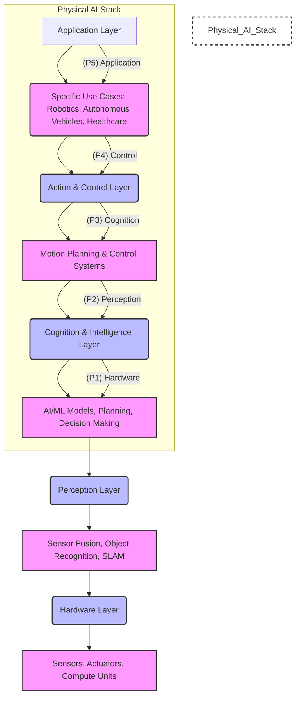

# Chapter 1: Physical AI: Bridging the Digital and Physical Worlds

## Learning Objectives

By the end of this chapter, you will:
- ✅ Understand the fundamental concept of Physical AI and its distinction from traditional AI.
- ✅ Identify key characteristics and components of Physical AI systems.
- ✅ Explore diverse applications of Physical AI across various industries.
- ✅ Recognize the challenges and future prospects in the field of Physical AI.

## Introduction

Artificial Intelligence (AI) has rapidly transformed various aspects of our lives, from smart assistants to complex data analysis. However, much of this progress has traditionally been confined to the digital realm, where AI processes information and makes decisions within virtual environments or based on abstract data. Physical AI represents a significant evolution, extending the capabilities of AI into the tangible world. This chapter introduces the foundational concept of Physical AI, highlighting how it enables machines to perceive, understand, and directly interact with their physical surroundings. We will delve into its core characteristics, explore its transformative applications, and discuss the inherent challenges and exciting future prospects of this rapidly emerging field.

## What is Physical AI?

Physical AI integrates artificial intelligence with physical systems, allowing machines to interact directly with the real world. Unlike traditional AI, which often operates on digital data or relies on human input, Physical AI systems gather information from their environment through various sensors and enact changes through actuators. This field aims to solve real-world problems that demand the ability to observe, collect, and integrate heterogeneous data for automated reasoning and action.

### Virtual AI vs. Physical AI: A Comparison

To better understand Physical AI, it's helpful to compare it with what might be termed "Virtual AI" or traditional AI systems that primarily operate in digital domains.

| Aspect                | Virtual AI (Traditional AI)                          | Physical AI                                                |
|-----------------------|------------------------------------------------------|------------------------------------------------------------|
| **Nature of Interaction** | Primarily digital, often human-initiated or simulated | Direct physical, autonomous interaction with real world    |
| **Primary Domain**    | Software, data centers, cloud platforms, simulations | Robotics, autonomous systems, embodied agents              |
| **Key Components**    | Algorithms, data, computing infrastructure           | Algorithms, sensors, actuators, physical embodiment, data |
| **Data Type**         | Digital datasets, text, images, structured data      | Real-time sensor data (vision, lidar, tactile, audio), environmental feedback |
| **Learning Environment** | Primarily simulated, virtual, or static datasets   | Real-world environments, often dynamic and unpredictable |
| **Example Applications** | Recommendation systems, chatbots, predictive analytics, image recognition (digital) | Autonomous vehicles, humanoid robots, industrial automation, drones, smart appliances |
| **Primary Challenges** | Data bias, scalability, interpretability, computational power | Safety, reliability, cost, real-time processing, sensor fusion, ethical implications |

## Key Characteristics of Physical AI Systems

Physical AI systems are defined by several distinguishing characteristics:
- **Direct Interaction with the Physical World**: These systems actively observe their environment using an array of sensors (e.g., cameras, microphones, LiDAR, radar, temperature sensors, inertial measurement units) and modify it through actuators (e.g., motors, robotic arms, wheels).
- **Perception and Decision-Making**: Leveraging advanced AI algorithms, including machine learning, neural networks, and reinforcement learning, Physical AI processes sensor data to identify patterns, recognize objects, make dynamic decisions, and adapt to unpredictable environments.
- **Embodiment**: Physical AI systems are embodied in tangible forms such as robots, drones, autonomous vehicles, and various smart devices, enabling their physical presence and interaction.
- **Real-time Processing**: Many Physical AI applications necessitate instantaneous perception and reasoning to comprehend an environment and respond rapidly, particularly in dynamic and uncertain settings.
- **Continuous Learning**: These systems are designed to learn through trial and error, continuously refining their performance and adapting to new situations based on feedback from their interactions with the physical world.

### The Physical AI Stack

The functionality of a Physical AI system can often be conceptualized as a layered stack, where each layer builds upon the capabilities of the one below it. This hierarchical structure allows for modular development and clearer understanding of complex interactions.

**Figure 1.1**: A conceptual layered stack of a Physical AI system, illustrating the flow from hardware to application.

## Applications of Physical AI

Physical AI is revolutionizing numerous industries by automating complex tasks, enhancing safety, and boosting efficiency:
-   **Robotics**: A central pillar of Physical AI, leading to advancements in dexterous robotic arms for intricate assembly, agile drones for complex maneuvers, and humanoid robots capable of sophisticated tasks.
-   **Autonomous Vehicles**: Self-driving cars, delivery robots, and intelligent construction equipment utilize Physical AI for navigation, obstacle avoidance, and real-time operational decision-making.
-   **Healthcare**: AI-powered surgical systems offer precision in operations, robotic exoskeletons assist in rehabilitation, and autonomous robots handle tasks like supply delivery and patient assistance.
-   **Manufacturing**: Adaptive robots are transforming assembly lines, improving quality control through AI-driven defect detection, and enabling highly automated "smart factories."
-   **Logistics and Warehousing**: Autonomous warehouse robots and delivery systems streamline operations, optimizing efficiency in complex logistical environments.
-   **Agriculture**: AI-powered drones and robotic systems assist with precision farming tasks, including crop monitoring, pest detection, and automated harvesting.
-   **Security and Surveillance**: Patrol robots and drones equipped with advanced perception systems enhance monitoring capabilities and threat detection.
-   **Smart Infrastructure**: Intelligent traffic systems, energy-efficient buildings, and automated public services contribute to the development of smarter, more responsive urban environments.

## Challenges in Physical AI

Despite its immense potential, Physical AI faces several significant hurdles:
-   **Real-time Data Processing**: Many applications demand instantaneous interpretation and analysis of massive data streams, pushing the boundaries of current processing technologies.
-   **Reliability and Safety**: Ensuring the robust reliability of AI-driven decisions in dynamic, unpredictable environments is paramount, especially where errors can have severe consequences.
-   **Cost and Scalability**: The development and deployment of advanced Physical AI systems, encompassing sophisticated sensors, processors, and actuators, require substantial financial investment, hindering widespread adoption.
-   **Data Scarcity and Quality**: High-quality data from diverse, real-world environments is essential but often costly and time-consuming to collect and label, particularly for rare or unusual events.
-   **Integration with Existing Infrastructure**: Incorporating Physical AI into existing operational systems frequently necessitates extensive modifications, contributing to higher implementation costs and potential disruptions.
-   **Ethical and Privacy Issues**: The growing autonomy of Physical AI systems raises critical concerns regarding human trust, the ethics of machine decision-making, and data privacy.
-   **Workforce Impact**: While Physical AI can create new highly skilled jobs, it also requires significant reskilling and upskilling of the workforce as certain tasks become automated.
-   **Regulatory Landscape**: Governments are still in the early stages of developing comprehensive regulations for Physical AI, creating uncertainty for businesses, especially concerning autonomous systems.

## Future Prospects of Physical AI

The Physical AI market is poised for substantial growth, attracting considerable investment from leading companies and numerous startups. Future advancements will be driven by breakthroughs in hardware (including more sophisticated sensors, actuators, and processors), the development of smarter materials, and innovative decentralized coordination systems for robotic fleets. The continuous evolution of AI and machine learning algorithms will empower Physical AI systems to become even more adaptive, intelligent, and capable of tackling increasingly complex tasks in the real world.

## Summary

This chapter introduced Physical AI as a critical convergence of artificial intelligence and physical systems, enabling machines to intelligently perceive and interact with the real world. We explored its defining characteristics, including direct physical interaction, advanced perception, embodiment, real-time processing, and continuous learning. We also examined its wide-ranging applications across industries like robotics, autonomous vehicles, and healthcare, while acknowledging the significant challenges related to data processing, safety, cost, and ethics. The field holds immense promise, with ongoing innovations expected to expand the capabilities and societal impact of intelligent physical systems.

## Further Reading

-   **Books**:
    -   Coming Soon!

-   **Online Resources**:
    -   Coming Soon!

## Next Chapter

In [Chapter 2: A Brief History of Humanoid Robotics](./02-history.md), we'll explore the fascinating evolution of humanoid robotics, from early automatons to modern marvels.

---

**Checkpoint**: Can you explain Physical AI and provide three examples of its application to someone else? If yes, proceed!
