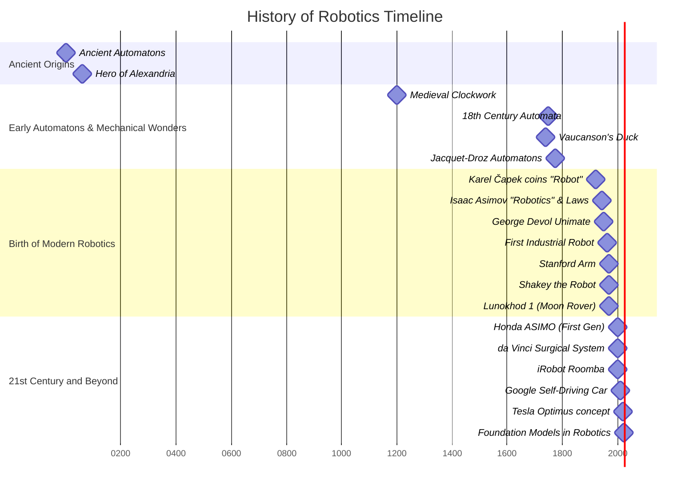

# Chapter 2: A Brief History of Humanoid Robotics

## Learning Objectives

By the end of this chapter, you will:
- ✅ Trace the evolution of humanoid concepts from ancient automatons to modern robots.
- ✅ Identify key milestones and influential figures in the development of humanoid robotics.
- ✅ Understand the technological advancements that enabled the creation of sophisticated humanoids.
- ✅ Recognize the societal and ethical considerations that have emerged alongside humanoid development.

## Introduction

The dream of creating machines in our own image is as old as humanity itself. From mythical figures to elaborate clockwork devices, the fascination with automatons that mimic human form and function has been a recurring theme throughout history. This chapter embarks on a journey through time, exploring the rich and often surprising history of humanoid robotics. We will uncover the ancient roots of this ambition, chronicle the ingenious creations of past centuries, and delve into the pivotal scientific and engineering breakthroughs that transformed fantasy into the sophisticated humanoid robots we see today.

## Ancient Dreams and Early Automatons

The concept of human-like automatons can be traced back to antiquity. Ancient Egyptian water clocks, around 3000 B.C., featured moving figurines. Hellenic Egypt, in the second century B.C., saw hydraulically-operated statues, while Greek mythology, such as the tales of Hephaestus and Talos, spoke of artificial beings. Hero of Alexandria, a brilliant Greek engineer, documented automated devices controlled by steam and water. Similarly, Chinese craftsmen developed mechanical orchestras and moving figures during the Han Dynasty, showcasing an early blend of artistry and rudimentary engineering to bring inanimate objects to life.

## The Age of Clockwork Marvels

The Middle Ages introduced clockwork figures into religious settings, but it was the 17th and 18th centuries that truly marked a "Golden Age of Automata." During this period, intricate human-like automatons emerged, capable of performing complex actions such as drawing, writing, or playing musical instruments. Visionary creators like Jacques de Vaucanson, with his famous mechanical duck, and the skilled artisans Jacquet-Droz, who crafted life-like writing and drawing automatons, pushed the boundaries of mechanical engineering, captivating audiences and inspiring future generations with their ingenious clockwork marvels.

## The Dawn of Modern Robotics

The 20th century heralded the true birth of modern robotics. The term "robot" itself was coined in 1920 by Czech playwright Karel Čapek in his play "R.U.R." (Rossum's Universal Robots), deriving from the Czech word "robota" meaning forced labor. Later, Isaac Asimov, a prolific science fiction writer, not only coined the term "robotics" in the early 1940s but also formulated his influential Three Laws of Robotics, laying a foundational ethical framework for the interaction between humans and intelligent machines.

Technological advancements rapidly followed:
-   **1950**: George Devol invents Unimate, the first digitally operated and programmable robot.
-   **1961**: Joseph Engelberger, utilizing Devol's patent, deploys Unimate as the first industrial robot in a General Motors plant, revolutionizing manufacturing.
-   **1951**: Walter's mechanical robots demonstrate conditioned reflex learning.
-   **1968**: Marvin Minsky creates the computer-controlled Tentacle Arm.
-   **1969**: Victor Scheinman develops the Stanford Arm, widely recognized as the first electronic computer-controlled robotic arm, a precursor to many modern manipulators.

These innovations marked a critical shift from mere automatons to programmable machines capable of performing complex, repetitive tasks with precision and autonomy.

### Robotics History Timeline

To better visualize the evolution of robotics, the following timeline highlights key milestones:

**Figure 2.1**: A timeline illustrating key milestones and developments in the history of robotics.

## Humanoids Emerge (Late 20th Century)

While industrial robots transformed factories, the pursuit of human-like robots continued. The late 20th century saw significant strides in creating robots that could operate in human environments.
-   **1970s**: Mobile robots like Stanford Research Institute's Shakey demonstrated rudimentary reasoning capabilities and the ability to navigate its environment. The Soviet Union also achieved a milestone by landing Lunokhod 1, the world's first robotic rover, on the moon.
-   **1980s**: Robotic arms became ubiquitous in assembly lines, improving efficiency and safety, while advancements in microprocessors enabled more complex and precise control systems for robots.
-   **1990s**: The integration of computer vision and early machine learning techniques allowed robots to perform more intricate tasks and adapt to varying environments, broadening their potential applications beyond strictly controlled industrial settings.

A notable development in humanoid robotics was Honda's ASIMO (Advanced Step in Innovative Mobility), first introduced in **2000**. ASIMO represented a leap forward in bipedal locomotion and human-robot interaction, capable of walking, running, and interacting with people, becoming an icon of advanced humanoid design.

## 21st Century and Beyond

The 21st century has witnessed an acceleration in robotics, driven by exponential growth in computing power, sensor technology, and artificial intelligence. The integration of AI, particularly deep learning and reinforcement learning, has led to increasingly sophisticated and autonomous systems.

Key developments and examples include:
-   **Space Exploration**: NASA's Mars rovers (e.g., Sojourner, Spirit, Opportunity, Curiosity, Perseverance) have extended humanity's reach across the solar system, collecting invaluable scientific data.
-   **Healthcare**: The da Vinci surgical system, cleared by the FDA in 2000, showcased the transformative potential of robotics in minimally invasive surgery.
-   **Consumer Robotics**: Products like the iRobot Roomba (2002) brought autonomous robots into homes, performing everyday tasks like vacuuming.
-   **Autonomous Vehicles**: The emergence of self-driving cars from companies like Google (now Waymo) and Tesla has pushed the boundaries of robotic perception and navigation in complex human environments.
-   **Modern Humanoids**: Beyond ASIMO, projects like Boston Dynamics' Atlas demonstrate incredible agility and balance, while Tesla's Optimus represents a renewed push towards mass-produced, general-purpose humanoid robots capable of interacting and performing tasks in unstructured human environments.

Today, robotics is undergoing a new paradigm shift with the development of large foundation models. These models enable robots to learn from vast datasets, generalize across tasks, and adapt to novel situations with unprecedented flexibility, moving away from rigid programming towards more adaptable and intelligent behavior. This promises to unlock even more diverse applications for humanoids across various industries, bringing the ancient dream of a truly intelligent, human-like companion closer to reality.

## Summary

This chapter has explored the fascinating trajectory of humanoid robotics, from the earliest human aspirations to create lifelike automatons to the sophisticated, AI-driven humanoids of the 21st century. We traced the journey through ancient myths, the mechanical wonders of the clockwork era, and the foundational scientific and engineering breakthroughs of the modern age. Key milestones like the coining of "robot" and "robotics," the invention of the industrial robot, and the emergence of advanced humanoids like ASIMO and Optimus were highlighted. The continuous integration of artificial intelligence promises to further blur the lines between machine and human capabilities, ushering in an exciting future for humanoid robotics.

## Further Reading

-   **Books**:
    -   Coming Soon!

-   **Online Resources**:
    -   Coming Soon!

## Next Chapter

In [Chapter 3: Core Technologies of a Humanoid Robot](./03-core-tech.md), we'll delve into the fundamental components and engineering principles that enable humanoid robots to function and interact with the world.

---

**Checkpoint**: Can you name three significant historical milestones in humanoid robotics and explain their impact? If yes, proceed!
